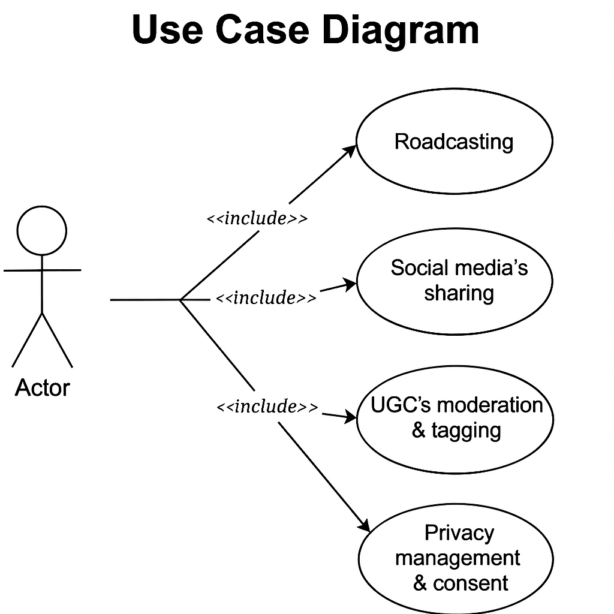
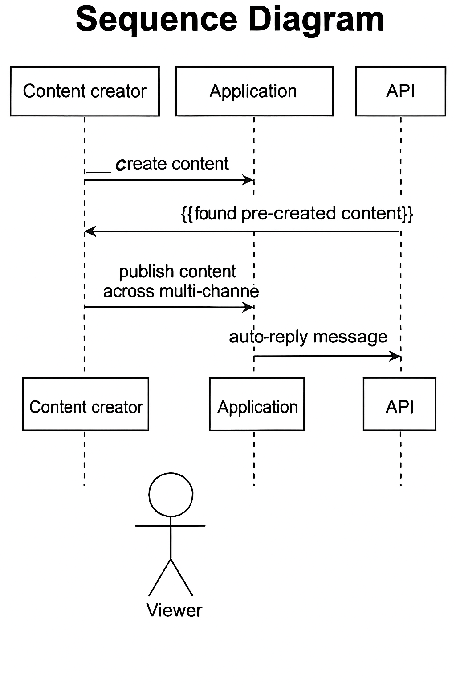
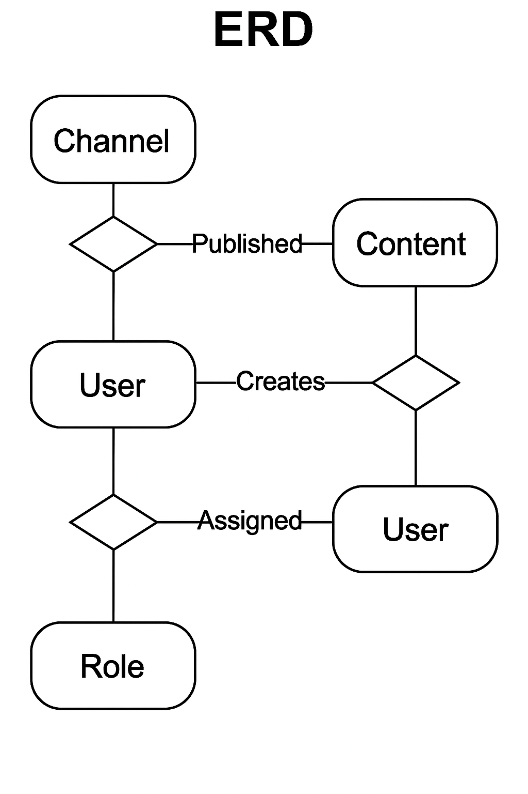

# 💡 Software Engineering Project – Mini project (Hệ thống Hub media bán lẻ đa kênh cho mỹ phẩm)

---

## 📘 Giới thiệu
Đây là đồ án môn học Nhập môn công nghệ phần mềm. Đề tài hướng đến xây dựng hệ thống Web App truyền thông đa phương tiện cho doanh nghiệp mỹ phẩm, hỗ trợ quản trị nội dung số và xuất bản đa kênh.

---

## 👩‍💻 Thành viên nhóm
- Thúy Ngọc - Leader 
- Thanh Nhàn

---

## 🎯 Mục tiêu
- Phát triển Web App truyền thông đa phương tiện cho doanh nghiệp.  
- Quản trị nội dung số, xuất bản đa kênh: Web, Facebook, Zalo, TikTok, YouTube.  
- Hỗ trợ livestream và clip ngắn.  
- Tối ưu SEO và tích hợp phân tích hiệu quả (Analytics).  
- Áp dụng SDLC: Waterfall hoặc Agile-Scrum.

---

## 📋 Nội dung
- Tích hợp Zalo OA/FB Page API: nhắn tin, auto-reply.  
- Chức năng chia sẻ mạng xã hội (social share).  
- Quản trị nội dung do người dùng tạo (UGC): duyệt, gắn thẻ.  
- Phân tích hiệu quả từng kênh truyền thông.  
- Phân hệ quản lý quyền riêng tư và tuân thủ: thu thập consent, ghi log truy cập.

---

## 🛠️ Thiết kế hệ thống
- Use Case chính  
- Quản lý nội dung  
- Quản lý người dùng  
- Quản lý phân quyền và tuân thủ

---

## 📐 Các sơ đồ thiết kế
### Use Case Diagram

###  Sơ đồ Sequence Diagram

### ERD (Entity Relationship Diagram)

---

## 💻 Công nghệ sử dụng
- Ngôn ngữ lập trình: Java / JavaScript / PHP / HTML  
- IDE: Visual Studio Code  
- Cơ sở dữ liệu: MySQL  
- Quản lý phiên bản: Git  
- Phương pháp phát triển: Agile – Scrum

---

## 🚀 Cài đặt và chạy thử
- Clone repo: https://github.com/thanhnhanthuyngoc-boop/Software-Engineering-Project-git